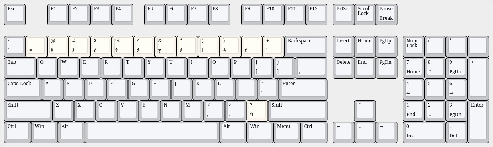

# My Czech programmer keyboard

This is my own custom Czech programming layout for X keyboard extension (also works on Wayland!).
It is based on the US ANSI 104 layout, but with diacritics in the top row.

Oh and you'll need a keypad.
Keypad supremacy.

## Visualisation


Image created with [Keyboard layout editor](http://www.keyboard-layout-editor.com/##@@_c=%23c5c7ca%3B&=Esc&_x:1%3B&=F1&=F2&=F3&=F4&_x:0.5%3B&=F5&=F6&=F7&=F8&_x:0.5%3B&=F9&=F10&=F11&=F12&_x:0.25%3B&=PrtSc&=Scroll%20Lock&=Pause%0ABreak%3B&@_y:0.5%3B&=~%0A%60&_c=%23f7f2ea%3B&=!%0A%2F=&=%2F@%0A%C4%9B&=%23%0A%C5%A1&=$%0A%C4%8D&=%25%0A%C5%99&=%5E%0A%C5%BE&=%2F&%0A%C3%BD&=*%0A%C3%A1&=(%0A%C3%AD&=)%0A%C3%A9&=%2F_%0A%C3%BA&=+%0A%C2%B4&_c=%23c5c7ca&w:2%3B&=Backspace&_x:0.25%3B&=Insert&=Home&=PgUp&_x:0.25%3B&=Num%20Lock&=%2F%2F&=*&=-%3B&@_w:1.5%3B&=Tab&=Q&=W&=E&=R&=T&=Y&=U&=I&=O&=P&=%7B%0A%5B&=%7D%0A%5D&_w:1.5%3B&=%7C%0A%5C&_x:0.25%3B&=Delete&=End&=PgDn&_x:0.25%3B&=7%0AHome&=8%0A%E2%86%91&=9%0APgUp&_h:2%3B&=+%3B&@_w:1.75%3B&=Caps%20Lock&=A&=S&=D&=F&=G&=H&=J&=K&=L&=%2F:%0A%2F%3B&=%22%0A'&_w:2.25%3B&=Enter&_x:3.5%3B&=4%0A%E2%86%90&=5&=6%0A%E2%86%92%3B&@_w:2.25%3B&=Shift&=Z&=X&=C&=V&=B&=N&=M&=%3C%0A,&=%3E%0A.&_c=%23f7f2ea%3B&=%3F%0A%C5%AF&_c=%23c5c7ca&w:2.75%3B&=Shift&_x:1.25%3B&=%E2%86%91&_x:1.25%3B&=1%0AEnd&=2%0A%E2%86%93&=3%0APgDn&_h:2%3B&=Enter%3B&@_w:1.25%3B&=Ctrl&_w:1.25%3B&=Win&_w:1.25%3B&=Alt&_a:7&w:6.25%3B&=&_a:4&w:1.25%3B&=Alt&_w:1.25%3B&=Win&_w:1.25%3B&=Menu&_w:1.25%3B&=Ctrl&_x:0.25%3B&=%E2%86%90&=%E2%86%93&=%E2%86%92&_x:0.25&w:2%3B&=0%0AIns&=.%0ADel).

## Instalation
just simply put `ce` into `/usr/share/X11/xkb/symbols/` and then
```setxkbmap -layout ce```.

```bash
# cd /usr/share/X11/xkb/symbols/
# wget wget https://raw.githubusercontent.com/3top1a/Czechish-programing-keyboard/main/ce
$ setxkbmap -layout ce
```

i3 config
```i3
# ce
bindsym $mod+equal    workspace  $ws1
bindsym $mod+ecaron   workspace $ws2
bindsym $mod+scaron   workspace $ws3
bindsym $mod+ccaron   workspace $ws4
bindsym $mod+rcaron   workspace $ws5
bindsym $mod+zcaron   workspace $ws6
bindsym $mod+yacute   workspace $ws7
bindsym $mod+aacute   workspace $ws8
bindsym $mod+iacute   workspace $ws9
bindsym $mod+eacute   workspace $ws10

bindsym $mod+Shift+equal    move container to workspace  $ws1
bindsym $mod+Shift+ecaron   move container to workspace $ws2
bindsym $mod+Shift+scaron   move container to workspace $ws3
bindsym $mod+Shift+ccaron   move container to workspace $ws4
bindsym $mod+Shift+rcaron   move container to workspace $ws5
bindsym $mod+Shift+zcaron   move container to workspace $ws6
bindsym $mod+Shift+yacute   move container to workspace $ws7
bindsym $mod+Shift+aacute   move container to workspace $ws8
bindsym $mod+Shift+iacute   move container to workspace $ws9
bindsym $mod+Shift+eacute   move container to workspace $ws10
```
